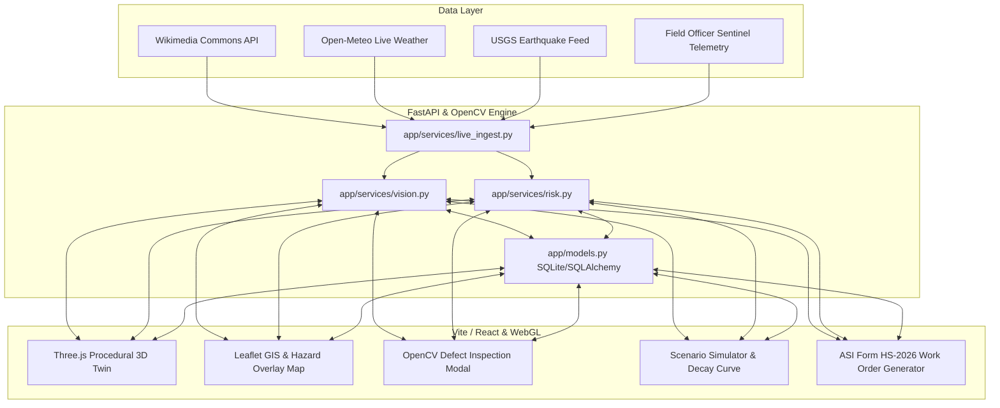
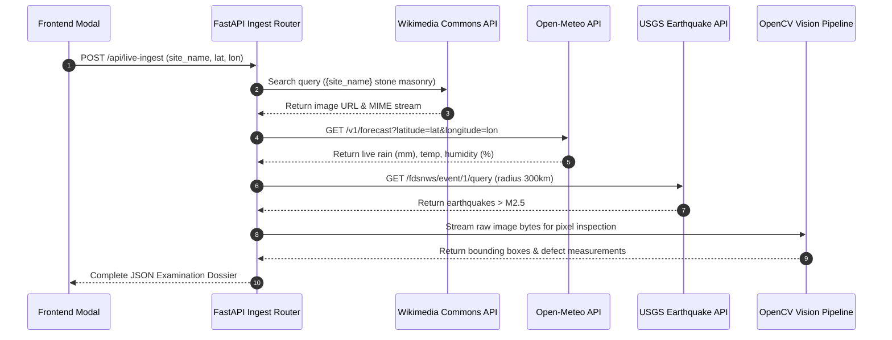
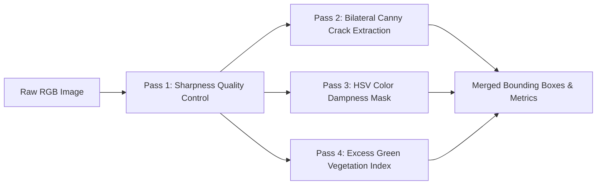
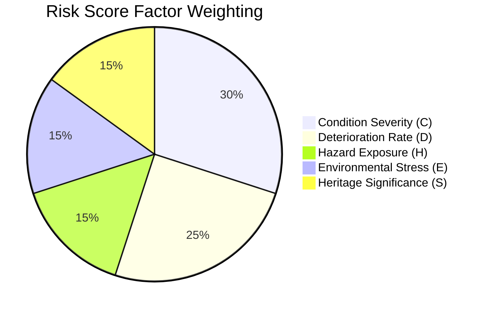
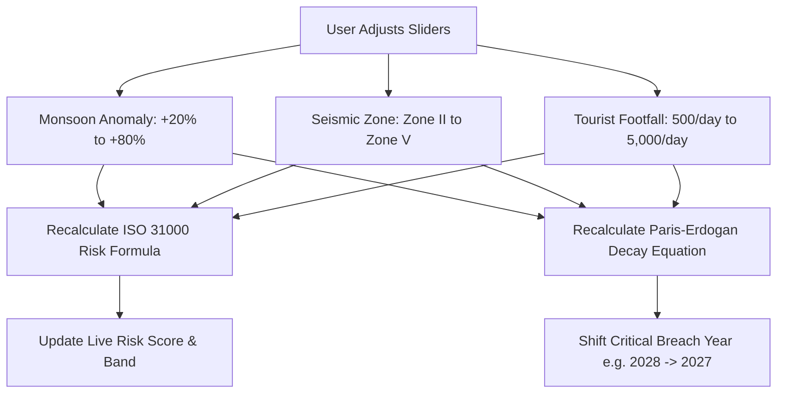

# 🛡️ Heritage Shield — Complete Technical Architecture & "How It Works" Guide

> **AI-Powered Multi-Scale Predictive Conservation & Resilient Digital Twin for Built Heritage**  
> *Smart India Hackathon 2026 · Team Qualified (Team ID: 031)*

---

## 📑 Master Table of Contents
1. [Executive Architectural Overview](#1-executive-architectural-overview)
2. [HOW We Ingest Data (Multi-Modal Data Pipeline)](#2-how-we-ingest-data-multi-modal-data-pipeline)
3. [HOW We Digitise & Render (3D Living Digital Twin)](#3-how-we-digitise--render-3d-living-digital-twin)
4. [HOW We Detect Damage (AI Computer Vision Engine)](#4-how-we-detect-damage-ai-computer-vision-engine)
5. [HOW We Assess Risk (Explainable ISO 31000 Risk Engine)](#5-how-we-assess-risk-explainable-iso-31000-risk-engine)
6. [HOW We Predict Decay (Physics-Informed Trajectory Engine)](#6-how-we-predict-decay-physics-informed-trajectory-engine)
7. [HOW We Track Longitudinal Delta (Multi-Epoch Time Series)](#7-how-we-track-longitudinal-delta-multi-epoch-time-series)
8. [HOW We Simulate Climate & Hazard Scenarios](#8-how-we-simulate-climate--hazard-scenarios)
9. [HOW We Triage & Prioritize (National Authority Queue)](#9-how-we-triage--prioritize-national-authority-queue)
10. [HOW We Generate Official ASI Work Orders & PDF Dossiers](#10-how-we-generate-official-asi-work-orders--pdf-dossiers)
11. [HOW The Backend & Database System Operates](#11-how-the-backend--database-system-operates)

---

## 1. Executive Architectural Overview

Heritage Shield solves the fundamental challenge of heritage preservation: **moving from reactive, periodic, and fragmented paper inspections to a proactive, continuous, component-centric decision system.**

### The Core Closed-Loop Pipeline

$$\text{Observe} \rightarrow \text{Digitise} \rightarrow \text{Assess} \rightarrow \text{Track} \rightarrow \text{Predict} \rightarrow \text{Prioritise} \rightarrow \text{Act} \rightarrow \text{Learn}$$



---

## 2. HOW We Ingest Data (Multi-Modal Data Pipeline)

Data ingestion occurs autonomously in `app/services/live_ingest.py` and `app/services/weather.py`. The system connects four distinct data streams:



### 1. Ingestion Protocol Breakdown
- **Public Heritage Imagery (Wikimedia Commons API)**:
  - Queries `https://commons.wikimedia.org/w/api.php` with encoded strings like `"Qutub Minar stone masonry architecture"`.
  - Filters response MIME types for JPEG/PNG image streams and downloads raw bytes directly into memory without disk storage.
- **Meteorological Stream (Open-Meteo API)**:
  - Fetches real-time precipitation ($\text{mm}$), relative humidity ($\%$), temperature ($^\circ\text{C}$), and 7-day forecast for exact monument coordinates.
  - Computes the **Environmental Stress Index ($E$)**.
- **Seismic Hazard Stream (USGS / NCS API)**:
  - Queries real-time seismic activity ($> M2.5$) within a 300 km radius of the site coordinates.
  - Calculates ground acceleration threat based on Indian Standard **BIS IS 1893 (Part 1): 2016** seismic zone classifications (Zone II to Zone V).
- **Field Officer Telemetry (Heritage Sentinel)**:
  - Mobile-responsive frontend modal (`FieldReportModal.jsx`) allowing ground personnel or visitors to upload real-time photo observations, GPS coordinates, and urgent site notes.

---

## 3. HOW We Digitise & Render (3D Living Digital Twin)

The 3D Living Digital Twin (`MonumentViewer3D.jsx`) provides the spatial interface for the product.

```text
 ┌────────────────────────────────────────────────────────────────────────┐
 │                     Three.js WebGL Canvas Context                      │
 │                                                                        │
 │   Procedural Canvas Textures ──> Normal/Bump Maps ──> Mesh Assemblies │
 │         (Sandstone / Marble / Granite / Basalt PBR Shaders)            │
 │                                                                        │
 │   9 Typologies:                                                        │
 │   - Mughal Minar Shaft          - Dravidian Temple Vimana             │
 │   - Nagara Temple Shikhara      - Rock-Cut Cave Temple (Ajanta)       │
 │   - Sanchi Stupa Dome           - Golconda Fort Bastion               │
 │   - Rani ki Vav Stepwell        - Colonnade / Archway                 │
 │                                                                        │
 │   3D World Vector3 (X,Y,Z) ──> Camera Projection ──> 2D Hotspot Overlays│
 └────────────────────────────────────────────────────────────────────────┘
```

### 1. Procedural PBR Texture Generation
To allow instant WebGL loading without downloading multi-gigabyte photogrammetry files over low bandwidth, the system features an in-browser **Procedural Canvas Texture Engine**:
```javascript
// Creates a 512x512 HTML5 Canvas and converts it into a Three.CanvasTexture
if (type === 'sandstone') {
  ctx.fillStyle = '#A88258'; // Warm sandstone base
  ctx.fillRect(0, 0, 512, 512);
  for (let y = 0; y < 512; y += 4) {
    const alpha = Math.sin(y * 0.08) * 0.15 + 0.15;
    ctx.fillStyle = `rgba(80, 50, 20, ${alpha})`; // Sedimentary bedding planes
    ctx.fillRect(0, y, 512, 2);
  }
}
```
Textures are assigned to `MeshStandardMaterial` with configurable roughness (`0.85`), metalness (`0.1`), and bump scale (`0.05`).

### 2. Component Mesh Hierarchy & Mapping
Each 3D monument is assembled from individual geometric meshes (e.g., Base Plinth, Lower Shaft, Upper Balcony, Finial). Every mesh is assigned a unique `mesh_cluster_id` matching backend database records in `app/models.py`.

### 3. 3D-to-2D Spatial Hotspot Projection
Hotspots indicating defect locations are stored as 3D spatial vectors $(X, Y, Z)$. In every animation frame, Three.js projects 3D coordinates onto screen space $(px, py)$:
```javascript
const vector = new THREE.Vector3(hotspot.x, hotspot.y, hotspot.z);
vector.project(camera);
const screenX = (vector.x * 0.5 + 0.5) * canvasWidth;
const screenY = (-(vector.y * 0.5) + 0.5) * canvasHeight;
```
Clicking a hotspot focuses the 3D orbit controls camera directly onto the component and loads its complete inspection trail.

---

## 4. HOW We Detect Damage (AI Computer Vision Engine)

When an image is submitted, `analyze_inspection_image()` in `app/services/vision.py` executes a **4-pass Computer Vision feature extraction pipeline**:



### Pass 1: Sharpness Quality Control (Laplacian Variance)
Converts image to grayscale ($I_{\text{gray}}$) and computes the variance of the 2D Laplacian operator:

$$\text{Score} = \text{Var}\left(\nabla^2 I_{\text{gray}}\right) = \text{Var}\left(\frac{\partial^2 I}{\partial x^2} + \frac{\partial^2 I}{\partial y^2}\right)$$

- **Threshold**: If $\text{Score} > 80$, the image is rated **Sharp / Optimal**; if $<80$, it is flagged as soft/blurred to prevent noise edge artifacts.

---

### Pass 2: Structural Crack & Fissure Extraction
1. **Bilateral Filtering**: Filters out high-frequency stone grain texture while preserving sharp structural boundaries:
   $$I_{\text{filtered}}(p) = \frac{1}{W_p} \sum_{q \in S} I(q) f_r(\|I(f) - I(q)\|) g_s(\|p - q\|)$$
   *(Parameters: $d=9, \sigma_{\text{color}}=75, \sigma_{\text{space}}=75$)*.
2. **Canny Edge Detection**: Detects directional intensity gradients with hysteresis thresholds $(35, 120)$.
3. **Morphological Closing**: Connects broken crack segments using a rectangular $3\times3$ structuring element:
   $$A \bullet B = (A \oplus B) \ominus B$$
4. **Contour Metrics & Physical Measurement**:
   Extracted crack contours are measured for arc length ($L_{\text{px}}$) and converted to physical centimeters ($\text{cm}$) and aperture width ($\text{mm}$):
   $$\text{Length (cm)} = \frac{L_{\text{px}}}{\text{Image Width (px)}} \times 60.0 \text{ cm}$$
   $$\text{Aperture Width (mm)} = \frac{\min(W_{\text{bbox}}, H_{\text{bbox}})}{\text{Image Width (px)}} \times 12.0 \text{ mm}$$

---

### Pass 3: Moisture Ingress & Dampness Masking
1. Converts BGR to **HSV Color Space**.
2. Isolates dark, water-saturated masonry using the color mask:
   $$\text{Hue} \in [0, 50], \quad \text{Saturation} \in [30, 255], \quad \text{Value} \in [20, 130]$$
3. Calculates surface coverage area:
   $$\text{Coverage \%} = \frac{\text{Count}(\text{Moisture Pixels})}{\text{Total Image Pixels}} \times 100$$

---

### Pass 4: Biological Vegetation & Lichen Intrusion
Computes the **Excess Green Index (EGI)** across RGB channels:

$$EGI = 2 \cdot G - R - B$$

Pixels where $EGI > 20$ isolate bryophyte colonies, moss, and lichen root intrusion on sandstone plinths, generating biological bounding boxes and coverage percentages.

---

## 5. HOW We Assess Risk (Explainable ISO 31000 Risk Engine)

Risk calculation in `app/services/risk.py` uses an explicit, policy-grade ISO 31000 weighted risk formula:

$$R = w_1 \cdot C + w_2 \cdot D + w_3 \cdot H + w_4 \cdot E + w_5 \cdot S$$



### Mathematical Factor Breakdown

| Variable | Factor Name | Computation Source | Scale |
| :---: | :--- | :--- | :---: |
| **$C$** | **Condition Severity** | Normalized OpenCV crack aperture, depth, and moisture area | 0 – 100 |
| **$D$** | **Deterioration Rate** | Multi-year crack extension velocity ($\text{cm/year}$) | 0 – 100 |
| **$H$** | **Hazard Exposure** | BIS IS 1893 Seismic Zone (Zone V = 100, Zone IV = 75, Zone III = 50) | 0 – 100 |
| **$E$** | **Environmental Stress** | Real-time Open-Meteo rainfall anomaly $\%$ and humidity | 0 – 100 |
| **$S$** | **Heritage Significance** | UNESCO World Heritage = 95, Centrally Protected Grade I = 85 | 0 – 100 |

### Action Triage Bands
- **High Urgency ($R \ge 70$)**: Immediate structural scaffolding inspection & moisture-barrier sealing within **30 days**.
- **Watch Band ($45 \le R < 70$)**: Re-inspect in next scheduled quarterly cycle (**60 days**).
- **Stable Band ($R < 45$)**: Routine annual photographic documentation.

---

## 6. HOW We Predict Decay (Physics-Informed Trajectory Engine)

Longitudinal decay trajectory prediction (`predict_temporal_decay_trajectory()`) simulates future structural degradation up to **2030** using coupled non-linear fracture mechanics and environmental stress equations.

### 1. Crack Expansion Equation (Paris-Erdogan Fatigue Law Adaptation)

$$\Delta c_t = (1.8 + 0.95 \cdot t) \times M_{\text{mat}} \times S_{\text{seismic}} \times E_{\text{env}}$$

- **Material Fragility Factor ($M_{\text{mat}}$)**:
  - Sandstone: `1.25` (Porous, high shear vulnerability)
  - Basalt: `0.95` (Capillary pore network)
  - Marble: `0.85` (Acid rain & frost sensitive)
  - Granite: `0.65` (High compressive strength)
- **Seismic Factor ($S_{\text{seismic}}$)**:
  - Zone V: `1.45`, Zone IV: `1.25`, Zone III: `1.05`, Zone II: `0.85`
- **Environmental Factor ($E_{\text{env}}$)**:
  $$E_{\text{env}} = 1.0 + \left(\frac{\text{Monsoon Anomaly \%}}{100}\right) \times 0.45$$

---

### 2. Health Index Decay Equation

$$H_{t+1} = \max\left(12, \; H_t - (11.0 + 3.5 \cdot t) \times (0.6 M_{\text{mat}} + 0.4 S_{\text{seismic}})\right)$$

When $H_t$ drops below **45**, the system triggers a **Critical Structural Breach Warning** and identifies the exact year (e.g., **2028**).

---

### 3. Unmitigated vs. Mitigated Comparison Simulation

The engine calculates two parallel paths from 2026 to 2030:
1. **Path A (Unmitigated Failure)**: No intervention. Crack length expands exponentially, moisture saturates to $55\%$, and health drops to $12\%$.
2. **Path B (Mitigated Action)**: Intervention applied in 2026 (ethyl silicate consolidant + breathable hydrophobic barrier). Crack growth halts, moisture evaporates to $<4\%$, and health score rebounds to $>90\%$.

---

## 7. HOW We Track Longitudinal Delta (Multi-Epoch Time Series)

Longitudinal tracking connects observations taken across different years (e.g., **2020 photogrammetry vs. 2024 inspection vs. 2026 OpenCV scan**).

```text
 2020 Baseline (12.4 cm crack, 91 Health)
      │
      ▼ (+2.7 cm extension)
 2022 Cycle    (15.1 cm crack, 84 Health)
      │
      ▼ (+3.1 cm extension)
 2024 Cycle    (18.2 cm crack, 76 Health)
      │
      ▼ (+6.9 cm extension - Branching Fissure)
 2026 Current  (25.1 cm crack, 62 Health)  ──>  Growth Velocity: 3.45 cm/yr (+38.2% since 2024)
```

The frontend time slider (`LongitudinalAnalytics.jsx`) allows conservation officers to drag across epochs, visualizing side-by-side photo comparisons and dynamic growth rate charts.

---

## 8. HOW We Simulate Climate & Hazard Scenarios

The **Scenario Simulator** (`ScenarioSimulator.jsx`) provides a real-time "What-If" engineering sandbox:



This allows site managers to test climate change resilience strategies before committing physical budgets.

---

## 9. HOW We Triage & Prioritize (National Authority Queue)

The **Authority Priority Queue** ranks monitored monuments across India by urgency:

$$\text{Priority Index} = \text{Rank}\Big(\text{Risk Score } (R) \quad \text{DESC}, \quad \text{Health Score } (H) \quad \text{ASC}\Big)$$

Monuments are sorted into a triage matrix:
1. **Critical Triage (Red)**: Risk Score $\ge 70$. Assigned top budget allocation and 30-day intervention deadline.
2. **Watch Triage (Amber)**: Risk Score $45\text{--}69$. Assigned quarterly monitoring.
3. **Stable Triage (Green)**: Risk Score $< 45$. Assigned routine annual documentation.

---

## 10. HOW We Generate Official ASI Work Orders & PDF Dossiers

When a component requires intervention, `AsiReportModal.jsx` compiles a formal **ASI Form HS-2026 Work Order**:

```text
┌────────────────────────────────────────────────────────────────────────┐
│               ARCHAEOLOGICAL SURVEY OF INDIA (ASI)                     │
│                   MINISTRY OF CULTURE, GOVT OF INDIA                   │
│                                                                        │
│ FORM HS-2026: URGENT CONSERVATION INTERVENTION DIRECTIVE               │
│ ────────────────────────────────────────────────────────────────────── │
│ Monument Code: ASI-NDL-QUT-001       Site: Qutub Minar Complex         │
│ Component: North Façade Wall         Elevation: +24.5 m                │
│ Defect Type: Tensile Shear Crack     Aperture: 2.4 mm                  │
│ Risk Score: 78.4 (High Urgency)      Breach Horizon: 2028              │
│ ────────────────────────────────────────────────────────────────────── │
│ RECOMMENDED ENGINEERING ACTION PLAN:                                   │
│ 1. Inject low-viscosity ethyl silicate consolidant into ashlar joint.   │
│ 2. Apply breathable hydrophobic silane moisture barrier within 30 days.│
│ 3. Erect temporary micro-strain gauging sensors for shear monitoring.   │
│ ────────────────────────────────────────────────────────────────────── │
│ Approval Ledger: [APPROVED BY CONSERVATION ARCHITECT ID #8841]         │
└────────────────────────────────────────────────────────────────────────┘
```

- **Export Capabilities**:
  - **Print to PDF**: Uses `html2canvas` and `jsPDF` to compile a print-ready vector PDF document with government letterhead.
  - **JSON Dossier**: Exports a machine-readable JSON structure for integration with enterprise government portals.

---

## 11. HOW The Backend & Database System Operates

### 1. Database Schema (`app/models.py`)
Built using **SQLAlchemy ORM** over SQLite/PostgreSQL:

```text
Site ──< Asset ──< Component ──< ConditionHistory
                      │
                      ├──< DamageDetection
                      ├──< RiskScore
                      └──< ExpertValidation
```

- **`Site`**: Stores name, state, lat/lon, seismic zone, monsoon risk, UNESCO status.
- **`Asset`**: Stores monument structures (e.g., Main Mausoleum, Minar Shaft).
- **`Component`**: Stores physical components (e.g., Finial, Base Plinth, Balcony).
- **`DamageDetection`**: Stores normalized OpenCV bounding boxes and confidence scores.
- **`ConditionHistory`**: Stores multi-year longitudinal time series (2020–2028).
- **`ExpertValidation`**: Stores human-in-the-loop signoff records (APPROVED / CORRECTED / REJECTED).

### 2. Execution & Deployment Setup
- **FastAPI Core**: Asynchronous API server (`uvicorn app.main:app --port 8000`).
- **Containerization**: Dual-container Docker setup (`docker-compose.yml`) running backend on `:8000` and frontend Vite on `:5173`.
- **Automated Verification Suite**: `test_suite.py` validates 11/11 end-to-end integration tests (OpenCV filters, SQLite seeding, Open-Meteo weather fetcher, and risk engine calculations).

---
*Smart India Hackathon 2026 · Team Qualified (Team ID: 031)*
